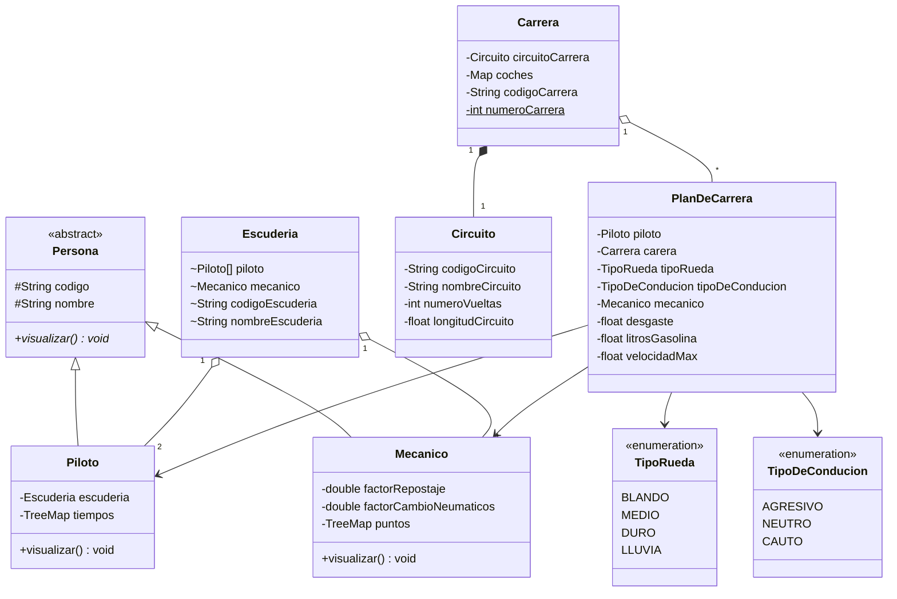

# 🏎️ Simulador Fórmula Uno

Simulador de carreras de Fórmula 1 desarrollado en Java. Permite gestionar escuderías, pilotos, mecánicos, circuitos y simular carreras con estrategias personalizadas.


---

## 📋 Tabla de Contenidos

- [Características](#-características)
- [Estructura del Proyecto](#-estructura-del-proyecto)
- [Diagrama de Clases](#-diagrama-de-clases)
- [Requisitos](#-requisitos)
- [Instalación](#-instalación)
- [Uso](#-uso)
- [Escuderías Incluidas](#-escuderías-incluidas)
- [Licencia](#-licencia)

---

## ✨ Características

- **Gestión de Escuderías**: Crear, modificar y eliminar equipos de F1
- **Gestión de Pilotos**: Administrar pilotos con tiempos y asignación a escuderías
- **Gestión de Mecánicos**: Control de mecánicos con factores de repostaje y cambio de neumáticos
- **Gestión de Circuitos**: Configurar circuitos con vueltas y longitud
- **Simulación de Carreras**: Simular carreras con planes de estrategia personalizados
- **Sistema de Marcador**: Visualizar resultados y puntuaciones
- **Persistencia de Datos**: Almacenamiento en archivos `.dat` mediante serialización

---

## 📁 Estructura del Proyecto

```
simuladorFormulaUno/
├── src/
│   ├── clases/                    # Clases del dominio
│   │   ├── Persona.java           # Clase abstracta base
│   │   ├── Piloto.java            # Piloto de F1
│   │   ├── Mecanico.java          # Mecánico del equipo
│   │   ├── Escuderia.java         # Equipo/Escudería
│   │   ├── Circuito.java          # Circuito de carreras
│   │   ├── Carrera.java           # Carrera con participantes
│   │   ├── PlanDeCarrera.java     # Estrategia de carrera
│   │   ├── TipoRueda.java         # Enum: BLANDO, MEDIO, DURO, LLUVIA
│   │   └── TipoDeConducion.java   # Enum: AGRESIVO, NEUTRO, CAUTO
│   │
│   ├── excepciones/               # Excepciones personalizadas
│   │   ├── AbandonoException.java
│   │   ├── DatosInvalidosException.java
│   │   ├── ElementoDuplicadoException.java
│   │   ├── ElementoNoEncontradoException.java
│   │   └── OperacionCanceladaException.java
│   │
│   ├── metodos/                   # Lógica de gestión
│   │   ├── CargarDatos.java
│   │   ├── GestionCarrera.java
│   │   ├── GestionCircuitos.java
│   │   ├── GestionEscuderia.java
│   │   ├── GestionMecanicos.java
│   │   ├── GestionPilotos.java
│   │   ├── GestionPlanDeCarrera.java
│   │   └── LecturaMarcador.java
│   │
│   ├── utilidades/                # Utilidades
│   │   ├── Utilidades.java        # Métodos de entrada/validación
│   │   └── MyObjectOutputStream.java
│   │
│   └── main/
│       └── Main.java              # Punto de entrada
│
├── LICENSE                        # Apache License 2.0
└── README.md
```

---

## 🗂️ Diagrama de Clases



---

## 📦 Requisitos

- **Java**: JDK 17 o superior
- **IDE recomendado**: Eclipse, IntelliJ IDEA o VS Code

---

## 🚀 Instalación

1. **Clonar el repositorio**:
   ```bash
   git clone https://github.com/tu-usuario/simuladorFormulaUno.git
   cd simuladorFormulaUno
   ```

2. **Compilar el proyecto**:
   ```bash
   javac -d bin src/**/*.java
   ```

3. **Ejecutar**:
   ```bash
   java -cp bin main.Main
   ```

---

## 🎮 Uso

Al ejecutar el programa, se muestra el menú principal:

```
===== MENU =====
1.- Gestionar Escuderia
2.- Gestionar Circuitos
3.- Iniciar Carrera
4.- Mostrar marcador
0.- Salir
```

### Opciones del Menú

| Opción | Descripción |
|--------|-------------|
| **1** | Gestionar escuderías, pilotos y mecánicos |
| **2** | Añadir, modificar o eliminar circuitos |
| **3** | Iniciar una simulación de carrera |
| **4** | Ver el marcador de puntos |
| **0** | Salir del programa |

---

## 🏁 Escuderías Incluidas

El simulador viene precargado con los **5 equipos principales** de F1:

| Escudería | Pilotos | Mecánico Jefe |
|-----------|---------|---------------|
| **Red Bull Racing** | Max Verstappen, Sergio Pérez | Lee Stevenson |
| **Ferrari** | Charles Leclerc, Carlos Sainz | Diego Ioverno |
| **Mercedes** | Lewis Hamilton, George Russell | Ron Meadows |
| **McLaren** | Lando Norris, Oscar Piastri | Andrea Stella |
| **Aston Martin** | Fernando Alonso, Lance Stroll | Andy Stevenson |

### Circuitos Disponibles

- 🇧🇭 Bahrain International Circuit
- 🇸🇦 Jeddah Corniche Circuit
- 🇦🇺 Albert Park Circuit
- 🇦🇿 Baku City Circuit
- 🇺🇸 Miami International Autodrome

---

## 📄 Licencia

Este proyecto está licenciado bajo la **Apache License 2.0**. Consulta el archivo [LICENSE](LICENSE) para más detalles.

---

## 🤝 Contribuciones

Las contribuciones son bienvenidas. Por favor, abre un *issue* o envía un *pull request*.

---

<p align="center">
  <strong>🏆 ¡Que gane el mejor piloto! 🏆</strong>
</p>
